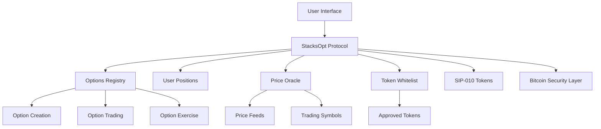

# StacksOpt - Decentralized Options Protocol

[](https://stacks.co)
[](https://bitcoin.org)

## Overview

StacksOpt is a comprehensive decentralized options protocol that enables secure creation, trading, and settlement of call and put options on Stacks Layer 2. Built on Bitcoin's security foundation, it provides institutional-grade options trading with automated settlement, oracle integration, and comprehensive risk management for the next generation of decentralized finance.

## Key Features

- **Bitcoin-Secured Trading**: Leverages Bitcoin's security through Stacks Layer 2
- **Call & Put Options**: Full support for both call and put option contracts
- **Automated Settlement**: Smart contract-based exercise and settlement
- **Oracle Integration**: Real-time price feeds for accurate option pricing
- **Risk Management**: Comprehensive collateral requirements and validation
- **Portfolio Management**: Track written and held positions across multiple options
- **Token Agnostic**: Support for any SIP-010 compliant token
- **Governance Features**: Administrative controls for protocol parameters

## System Architecture

### Core Components



### Contract Architecture

The protocol consists of several interconnected components:

#### 1. **Options Registry** (`options` map)

Central storage for all option contracts containing:

- Writer and holder information
- Collateral amounts and strike prices
- Expiry dates and exercise status
- Option type (CALL/PUT) and current state

#### 2. **User Portfolio Management** (`user-positions` map)

Tracks individual user positions including:

- Written options (up to 10 per user)
- Held options (up to 10 per user)
- Total collateral locked across positions

#### 3. **Oracle System** (`price-feeds` map)

Real-time price data management:

- Price feeds for trading symbols
- Timestamp validation
- Authorized oracle sources

#### 4. **Token Whitelist** (`approved-tokens` map)

Security layer for approved trading tokens:

- SIP-010 compliance verification
- Critical token protection
- Administrative controls

## Data Flow

### Option Creation Flow

```
1. User calls write-option()
2. Validate inputs (token, expiry, strike, collateral)
3. Lock collateral tokens in contract
4. Create option record in registry
5. Update user's written positions
6. Return unique option ID
```

### Option Purchase Flow

```
1. User calls buy-option()
2. Validate option exists and is active
3. Transfer premium to option writer
4. Update option holder information
5. Update buyer's held positions
```

### Option Exercise Flow

```
1. Holder calls exercise-option()
2. Validate authorization and option status
3. Get current market price from oracle
4. Calculate payout based on option type:
   - CALL: max(current_price - strike_price, 0)
   - PUT: max(strike_price - current_price, 0)
5. Transfer payout to holder
6. Return remaining collateral to writer
7. Mark option as exercised
```

## Smart Contract Functions

### Core Trading Functions

#### `write-option`

Creates a new option contract with specified parameters.

```clarity
(write-option token collateral-amount strike-price premium expiry option-type)
```

#### `buy-option`

Purchases an existing option contract by paying the premium.

```clarity
(buy-option token option-id)
```

#### `exercise-option`

Exercises an option contract if conditions are met.

```clarity
(exercise-option token option-id)
```

### Administrative Functions

#### `set-protocol-fee-rate`

Updates the protocol fee structure (owner only).

#### `update-price-feed`

Updates oracle price feeds for trading symbols (owner only).

#### `set-approved-token`

Manages the token whitelist for trading (owner only).

#### `set-allowed-symbol`

Manages approved trading symbols (owner only).

### Read-Only Functions

#### `get-option`

Retrieves option details by ID.

#### `get-user-position`

Returns user's portfolio information.

#### `get-protocol-fee-rate`

Returns current protocol fee rate.

## Error Handling

The protocol includes comprehensive error handling with specific error codes:

| Error Code | Description |
|------------|-------------|
| `u1000` | Not authorized |
| `u1001` | Insufficient balance |
| `u1002` | Invalid expiry date |
| `u1003` | Invalid strike price |
| `u1004` | Option not found |
| `u1005` | Option expired |
| `u1006` | Insufficient collateral |
| `u1007` | Already exercised |
| `u1008` | Invalid premium |

## Security Features

### Collateral Management

- **Call Options**: Require collateral ≥ strike price
- **Put Options**: Require collateral based on current market price
- **Locked Collateral**: Prevents double-spending until settlement

### Validation Layers

- **Token Whitelist**: Only approved SIP-010 tokens
- **Symbol Validation**: Verified trading pairs
- **Expiry Checks**: Prevents expired option trading
- **Authorization**: Role-based access control

### Oracle Security

- **Timestamp Validation**: Ensures fresh price data
- **Source Verification**: Authorized oracle providers only
- **Critical Symbol Protection**: Enhanced security for major pairs

## Usage Examples

### Creating a Call Option

```clarity
;; Create a BTC call option with $50,000 strike, expires in 100 blocks
(contract-call? .stacksopt write-option 
    .wrapped-btc 
    u5000000000  ;; 50 BTC collateral (8 decimals)
    u5000000000000  ;; $50,000 strike (6 decimals)
    u100000000   ;; 1 BTC premium
    (+ block-height u100)  ;; Expires in 100 blocks
    "CALL")
```

### Buying an Option

```clarity
;; Purchase option with ID 1
(contract-call? .stacksopt buy-option .wrapped-btc u1)
```

### Exercising an Option

```clarity
;; Exercise option with ID 1
(contract-call? .stacksopt exercise-option .wrapped-btc u1)
```

## Integration Guide

### For Developers

1. **Token Integration**: Ensure your token implements SIP-010 standard
2. **Whitelist Application**: Contact protocol governance for token approval
3. **Oracle Setup**: Implement price feed updates for new trading pairs
4. **Frontend Integration**: Use read-only functions for UI data

### For Traders

1. **Wallet Setup**: Use a Stacks-compatible wallet
2. **Token Approval**: Ensure sufficient balance and allowances
3. **Risk Assessment**: Understand collateral requirements
4. **Exercise Strategy**: Monitor option values and expiry dates

## Deployment Information

- **Network**: Stacks Mainnet/Testnet
- **Language**: Clarity Smart Contracts
- **Dependencies**: SIP-010 Token Standard
- **Gas Optimization**: Efficient data structures and validation

## Contributing

We welcome contributions to the StacksOpt protocol:

1. Fork the repository
2. Create a feature branch
3. Implement changes with tests
4. Submit a pull request

### Development Setup

```bash
# Install Clarinet
npm install -g @hirosystems/clarinet-cli

# Clone repository
git clone https://github.com/idarag/StacksOpt.git
cd StacksOpt

# Run tests
clarinet test

# Deploy locally
clarinet integrate
```

## Roadmap

### Phase 1 (Current)

- [x] Core options functionality
- [x] Oracle integration
- [x] Basic risk management

### Phase 2

- [ ] Advanced order types
- [ ] Liquidity pools
- [ ] Cross-chain integration

### Phase 3

- [ ] Governance token launch
- [ ] DAO transition
- [ ] Advanced derivatives
